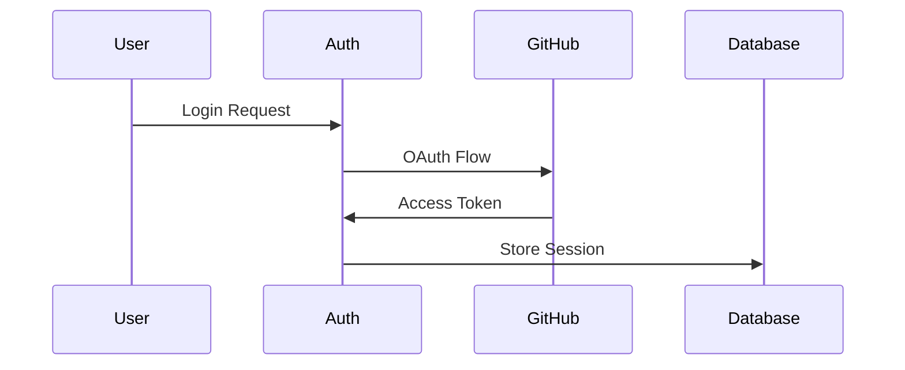

# 🔥 GitRoaster

<div align="center">

**AI-Powered Code Reviews That Don't Suck**

Stop waiting days for code reviews. Get them in minutes.

[](https://github.com/mrvineetraj/gitroaster)
[](LICENSE)
[](CONTRIBUTING.md)

[🚀 Try GitRoaster](https://www.gitroaster.space)


<video src="./public/demo/gitroaster_walkthrough.mp4"></video>

</div>

---

## 🎥 See GitRoaster in Action

<div align="center">

### ⚡ 2-Minute Demo: From GitHub to AI Review

_Watch how GitRoaster analyzes a real pull request and provides comprehensive AI-powered feedback in under 2 minutes._

**🎬 [Watch Full Demo →](./public/demo/gitroaster_walkthrough.mp4)**

</div>

<details>
<summary>📸 Quick Screenshots</summary>

### Dashboard Overview


### AI Review Results


### Repository Management


</details>

---

## 🎯 What is GitRoaster?

GitRoaster is an AI-powered code review platform that integrates seamlessly with your GitHub workflow. Get instant, high-quality code reviews that catch bugs, improve code quality, and accelerate your development process.

### ✨ Key Features

- 🚀 **Sub-2 Minute Reviews** - AI analyzes your code faster than you can grab coffee
- 🛡️ **Security & Bug Detection** - Catch vulnerabilities before they hit production
- 📊 **Visual Insights** - Sequence diagrams, ER diagrams, and activity flows
- 🎯 **Consistent Quality** - Every review follows the same high standards
- 🔒 **Privacy-First** - Your code is analyzed but never stored
- 👥 **Team Management** - Granular control over who gets reviews
- 👥 **Pull Request Chat Bot** - Ask about the pr review or how to fix security concern directly inside the pull request by adding @gitroaster to you comment

## 🏃‍♂️ Quick Start

### 1. Visit GitRoaster Platform

Go to [GitRoaster.space](https://www.gitroaster.space) and sign up for your account.

### 2. Connect GitHub

- Login to the GitRoaster dashboard
- Connect your GitHub account through OAuth
- Install the GitRoaster GitHub App

### 3. Configure Repositories

- Select repositories from your dashboard
- Set review preferences for each repo
- Choose team members for automatic reviews

### 4. Trigger Reviews
Automatically triggered when you raise a pull request

## 📊 Dashboard

<details>
<summary>View Dashboard Features</summary>

### Usage Analytics

- Track PR review statistics
- Monitor token usage
- View team performance metrics

### Repository Management

- Enable/disable repositories
- Configure review settings
- Manage team permissions

</details>

## 🔧 Tech Stack

<details>
<summary>View Full Tech Stack</summary>

### Frontend

- **Next.js 15** - React framework with App Router
- **TypeScript** - Type-safe development
- **Tailwind CSS** - Utility-first styling
- **Shadcn/UI** - Modern UI components

### Backend

- **tRPC** - End-to-end typesafe APIs
- **Prisma** - Database ORM
- **NextAuth.js** - Authentication
- **Inngest** - Background job processing

### Infrastructure

- **GitHub App** - Native GitHub integration
- **OpenAI API** - AI-powered code analysis
- **Webhooks** - Real-time PR processing

</details>

## 🚀 Features Deep Dive

### AI Code Analysis

GitRoaster provides comprehensive code reviews including:

- **Code Walkthrough** - Detailed explanation of changes
- **File Change Summary** - Quick overview of modifications
- **Critical Issues** - Security vulnerabilities and bugs
- **Suggestions** - Actionable improvement recommendations
- **Visual Diagrams** - Mermaid sequence and ER diagrams

### Platform-Based Workflow

All GitRoaster actions are performed through the web platform:

1. **Dashboard Control** - Manage all repositories from [gitroaster.space](https://www.gitroaster.space)
2. **Review Initiation** - Start code reviews directly from the platform
3. **Result Viewing** - Access detailed review results in your dashboard
4. **Team Collaboration** - Invite team members through the platform interface

### Example Review Output

````markdown
## Walkthrough

This PR introduces user authentication with secure session management...

## Changes

| File                 | Change Summary              |
| -------------------- | --------------------------- |
| `auth/auth-page.tsx` | Added OAuth login component |
| `lib/prisma.ts`      | Updated user schema         |

## Sequence Diagram


````
